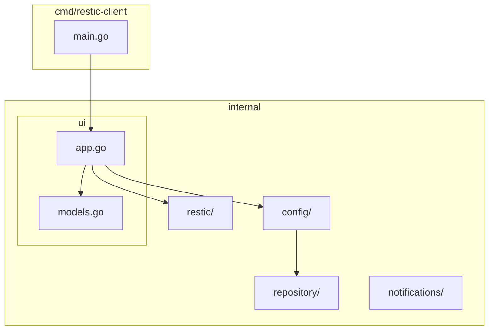
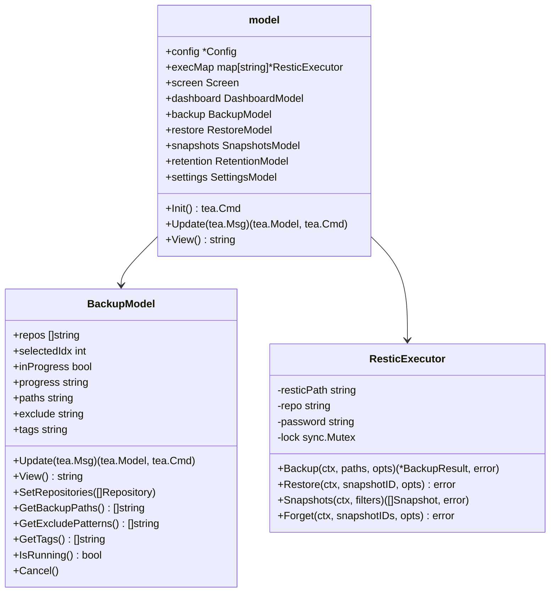
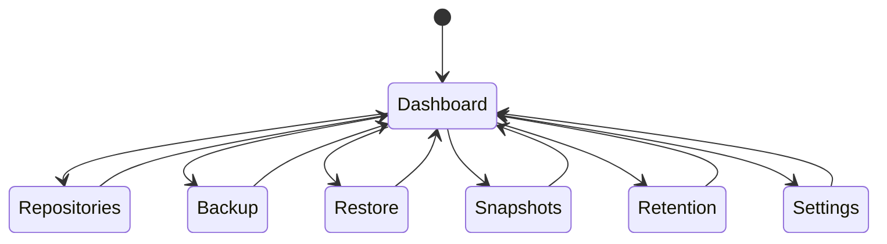
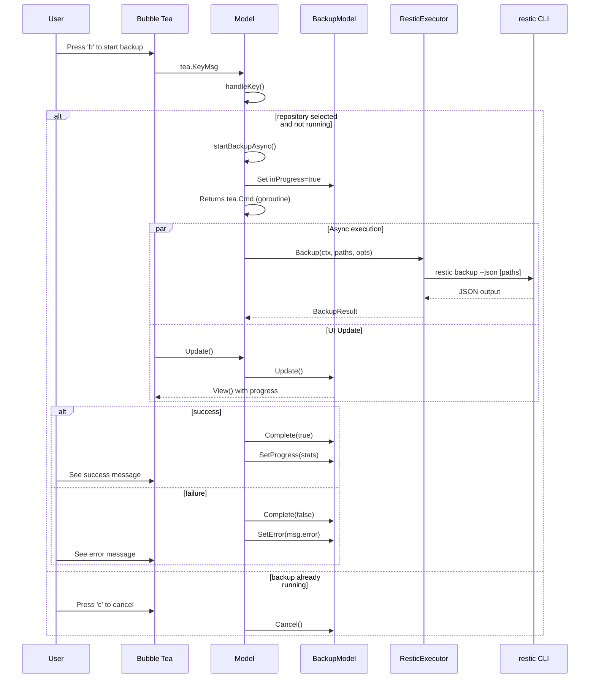
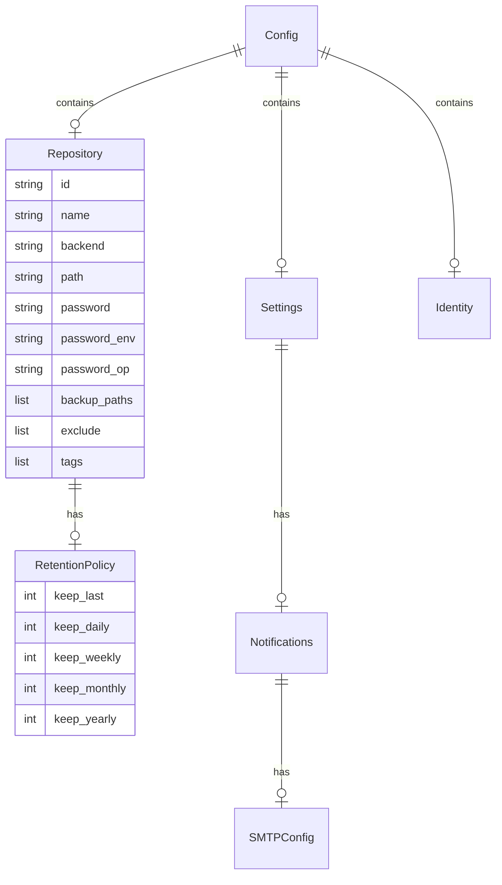
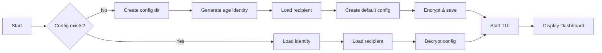

# Restic Backup Client - Design Document

## Overview

A Go-based Terminal User Interface (TUI) client for restic backup, built with Bubble Tea. Provides an interactive interface for managing backups, repositories, snapshots, and retention policies.

## Architecture

### Package Structure

### Component Diagram

## Screen Navigation

## Backup Flow

## Data Models

### Config Structure

## Configuration Flow

## Key Bindings

| Key | Action |
|-----|--------|
| 1 | Navigate to Dashboard |
| 2 | Navigate to Repositories |
| 3 | Navigate to Backup |
| 4 | Navigate to Restore |
| 5 | Navigate to Snapshots |
| 6 | Navigate to Retention |
| 7 | Navigate to Settings |
| b | Start backup (on Backup screen) |
| c | Cancel backup (when running) |
| n | Add new repository |
| q | Quit |
| ? | Show help |

## Environment Variables

| Variable | Description |
|----------|-------------|
| RESTIC_PASSWORD | Password for repository |
| RESTIC_REPOSITORY | Repository path/URL |
| RESTIC_CLIENT_PATH | Path to restic binary |
| XDG_CONFIG_HOME | Config directory base |

## Dependencies

- **Bubble Tea** - TUI framework
- **Lipgloss** - Terminal styling
- **Age** - Encryption for config storage

## Security

- Config stored in `~/.config/restic-client/`
- Encrypted with age (X25519)
- Repository passwords stored encrypted or via environment variable
- 1Password integration for password retrieval
