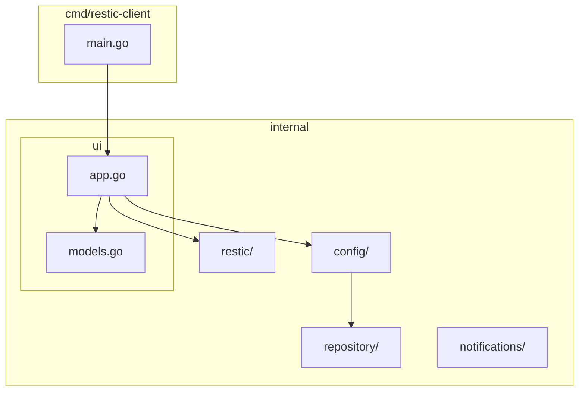
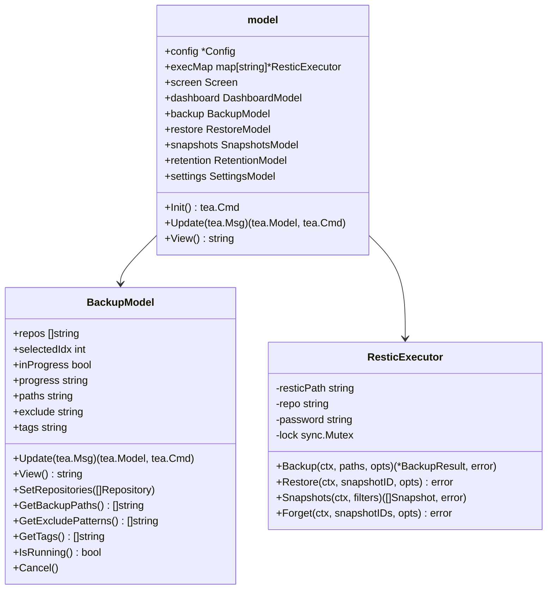
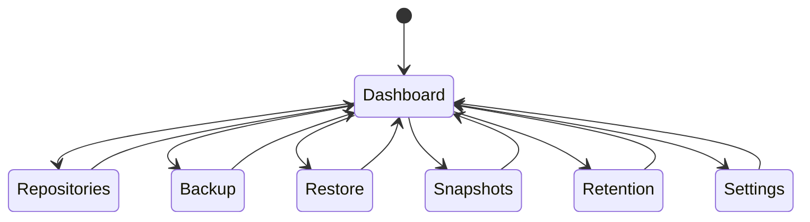
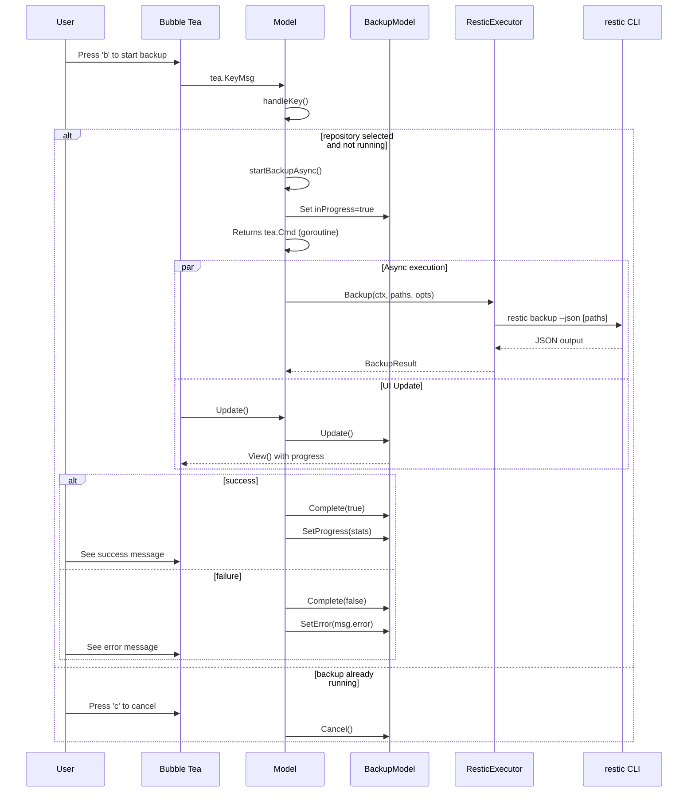
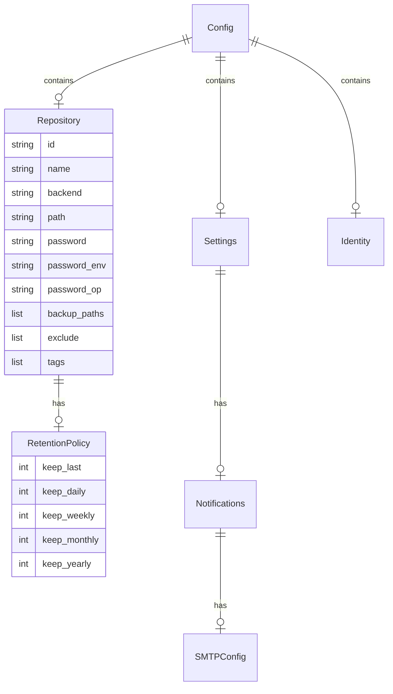
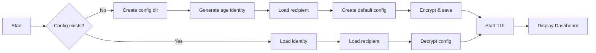

# Restic Backup Client - Design Document

## Overview

A Go-based Terminal User Interface (TUI) client for restic backup, built with Bubble Tea. Provides an interactive interface for managing backups, repositories, snapshots, and retention policies.

## Design Decisions

### Why Bubble Tea?

- **Minimal dependencies**: Built on standard Go patterns (context, channels)
- **Component-based**: Screens are composable models
- **Event-driven**: Clean separation between user input and rendering
- **Accessible**: Supports keyboard-only navigation

### Why age Encryption?

- **Modern cryptography**: X25519 key exchange, ChaCha20-Poly1305 encryption
- **No external dependencies**: Pure Go implementation
- **User-friendly**: Can use passphrase or key file
- **Secure by default**: Encrypts config at rest

### Async Operations

- **Non-blocking UI**: Long-running operations (backup, restore) run asynchronously
- **Progress feedback**: Users see operation status in real-time
- **Cancellation support**: Context-based cancellation for user control
- **Goroutine pattern**: Uses Bubble Tea's `tea.Cmd` for async execution

### Configuration Storage

- **Encrypted at rest**: Passwords and sensitive data never stored plaintext
- **Environment variable support**: Reference external secrets without storing
- **1Password integration**: Retrieve passwords from 1Password vault
- **Multi-repository support**: Single config file manages multiple repos

## Component Descriptions

### cmd/restic-client/main.go

The application entry point and main TUI model. Responsible for:

- Initializing the Bubble Tea program
- Loading and decrypting configuration
- Routing messages between screens
- Handling global keyboard shortcuts
- Managing screen transitions

**Key responsibilities:**
- Creates `model` struct holding all screen states
- Handles startup config initialization
- Routes `tea.Msg` to appropriate handlers
- Delegates screen-specific updates to sub-models

### internal/ui/models.go

Defines all screen models implementing the `tea.Model` interface:

| Model | Purpose |
|-------|---------|
| DashboardModel | Overview of repositories and backup status |
| ReposModel | Add, edit, remove repository configurations |
| BackupModel | Configure and execute backup operations |
| RestoreModel | Select snapshot and restore files |
| SnapshotsModel | Browse and filter repository snapshots |
| RetentionModel | Configure retention policies and prune |
| SettingsModel | Application preferences and notifications |

Each model implements:
- `Update(tea.Msg)` - Handle user input and state changes
- `View() string` - Return styled terminal output

### internal/restic/executor.go

Wrapper around the restic CLI. Provides:

- **Synchronous execution**: Runs restic commands via `exec.Command`
- **JSON parsing**: Automatically parses `--json` output
- **Option pattern**: Functional options for flexible configuration
- **Thread safety**: Mutex-protected command execution

**Key methods:**
- `Backup()` - Run backup with options (tags, excludes, dry-run)
- `Restore()` - Restore from snapshot with filters
- `Snapshots()` - List snapshots with host/path/tag filters
- `Forget()` - Remove snapshots with retention policy
- `Stats()` - Get repository size statistics

### internal/config/

Configuration management with encryption:

- **config.go** - Data structures for Config, Repository, Settings
- **encrypted.go** - Age-based encryption/decryption
- **onepassword.go** - 1Password CLI integration
- **config_test.go** - Configuration loading tests

### internal/repository/backends.go

Defines supported repository backends:

| Backend | Description |
|---------|-------------|
| local | Local filesystem path |
| sftp | SSH/SFTP remote |
| s3 | Amazon S3 compatible |
| b2 | Backblaze B2 |
| rest | REST server |
| rclone | rclone remote |

## Expected Behavior

### Startup Sequence

1. Check for existing config in `~/.config/restic-client/`
2. If missing, generate age identity and create default config
3. Load and decrypt config using stored identity
4. Initialize all screen models with repository list
5. Display Dashboard with repository overview

### Repository Management

1. User navigates to Repositories screen (key '2')
2. Press 'n' to add new repository
3. Fill in form: name, backend, path, password source
4. Press Enter to save (encrypted automatically)
5. Repository appears in list for all screens

### Backup Operation

1. Navigate to Backup screen (key '3')
2. Select repository with up/down arrows
3. Enter paths to backup (or use configured paths)
4. Set exclude patterns (comma-separated)
5. Add tags (optional)
6. Press 'b' to start backup

**Expected behavior during backup:**
- Screen shows "Backup in progress..." message
- Backup runs asynchronously (UI remains responsive)
- On completion: shows snapshot ID, files processed, bytes added
- On error: shows error message from restic CLI

### Restore Operation

1. Navigate to Restore screen (key '4')
2. Select repository
3. Press 'r' to load snapshots
4. Select snapshot from list
5. Enter target directory
6. Press Enter to restore

### Snapshot Management

1. Navigate to Snapshots screen (key '5')
2. Select repository
3. Apply filters: host, path, tag
4. Browse snapshots with timestamps and hosts
5. Select snapshot for details

### Retention Policy

1. Navigate to Retention screen (key '6')
2. Select repository
3. Configure: keep-last, keep-daily, keep-weekly, etc.
4. Toggle prune option
5. Toggle dry-run (preview) vs apply
6. Press Enter to execute

## Architecture

### Package Structure

### Component Diagram

## Screen Navigation

## Backup Flow

## Data Models

### Config Structure

### Repository Fields

| Field | Description | Required |
|-------|-------------|----------|
| id | Unique identifier | Auto |
| name | Display name | Yes |
| backend | Storage backend type | Yes |
| path | Repository path/URL | Yes |
| password | Encrypted password | No* |
| password_env | Env var for password | No* |
| password_op | 1Password item reference | No* |
| backup_paths | Default paths to backup | No |
| exclude | Default exclude patterns | No |
| tags | Default tags for backups | No |
| schedule | Cron schedule (future) | No |

*At least one password source required

## Configuration Flow

## Key Bindings

| Key | Action |
|-----|--------|
| 1 | Navigate to Dashboard |
| 2 | Navigate to Repositories |
| 3 | Navigate to Backup |
| 4 | Navigate to Restore |
| 5 | Navigate to Snapshots |
| 6 | Navigate to Retention |
| 7 | Navigate to Settings |
| b | Start backup (on Backup screen) |
| c | Cancel backup (when running) |
| n | Add new repository |
| q | Quit |
| ? | Show help |
| up/k | Move selection up |
| down/j | Move selection down |
| enter | Confirm/select |

## Environment Variables

| Variable | Description |
|----------|-------------|
| RESTIC_PASSWORD | Password for repository |
| RESTIC_REPOSITORY | Repository path/URL |
| RESTIC_CLIENT_PATH | Path to restic binary |
| XDG_CONFIG_HOME | Config directory base |

## Dependencies

- **Bubble Tea** (`github.com/charmbracelet/bubbletea`) - TUI framework
- **Lipgloss** (`github.com/charmbracelet/lipgloss`) - Terminal styling
- **Age** (`filippo.io/age`) - Encryption for config storage

## Security

- Config stored in `~/.config/restic-client/`
- Encrypted with age (X25519)
- Repository passwords stored encrypted or via environment variable
- 1Password integration for password retrieval
- Passwords never logged or displayed in plain text

## Future Considerations

- **Scheduled backups**: Cron-based automatic backups
- **Progress bar**: Real-time backup progress with file count
- **Mount**: FUSE mount for browsing snapshots
- **Cloud backends**: Additional cloud provider support
- **Notifications**: Email/webhook notifications on completion
